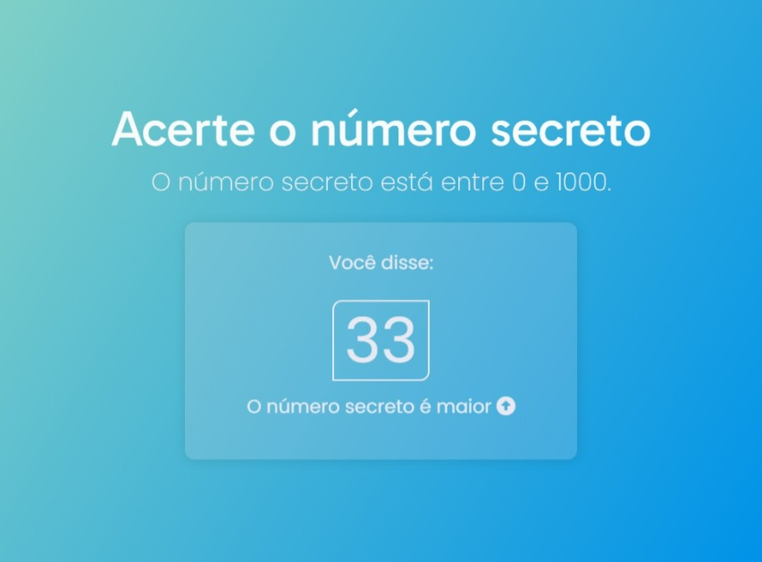

# Número Secreto

Um projeto feito para o curso "**JavaScript: validações e reconhecimento de voz**" da #Alura com o professor Guilherme Lima.

Trata-se de um jogo bastante divertido em que se usa a Web Speech API para reconhecimento de voz. Você fala um número até acertar o número secreto que ele sorteou!

Aproveite e divirta-se!

O projeto está disponível pelo [Vercel](https://numero-secreto-git-main-renansantos7.vercel.app/).
